# Project_template

Это шаблон для решения проектной работы. Структура этого файла повторяет структуру заданий. Заполняйте его по мере работы над решением.

# Задание 1. Анализ и планирование

<aside>

Чтобы составить документ с описанием текущей архитектуры приложения, можно часть информации взять из описания компании и условия задания. Это нормально.

</aside

### 1. Описание функциональности монолитного приложения

**Управление отоплением:**

- Пользователи могут удалённо включать и выключать отопление в своих домах через веб-интерфейс (посредством API-запроса `PATCH /api/v1/sensors/:id/value` для изменения статуса и значения реле).
- Система поддерживает отправку управляющих сигналов от сервера к датчику/реле для изменения его физического состояния.
- Для настройки и подключения оборудования требуется обязательный выезд специалиста, самообслуживание отсутствует.

**Мониторинг температуры:**

- Пользователи могут просматривать текущую температуру в комнатах в реальном времени через веб-интерфейс при запросе списка датчиков (`GET /api/v1/sensors`) или конкретного устройства (`GET /api/v1/sensors/:id`).
- Система поддерживает получение данных о температуре с датчиков путем выполнения синхронного HTTP-запроса к внешнему API датчиков в момент запроса пользователя.
- Пользователи могут запросить текущую температуру для определенной локации (комнаты) напрямую через эндпоинт `GET /api/v1/sensors/temperature/:location`.

### 2. Анализ архитектуры монолитного приложения

- **Язык программирования:** Go. Для реализации веб-сервера и маршрутизации запросов используется HTTP-фреймворк Gin.
- **База данных:** PostgreSQL. Работа с базой данных (хранение метаданных и конфигураций датчиков) реализована через пул соединений библиотеки `pgxpool`.
- **Взаимодействие между компонентами:** Полностью синхронное. Внутри одного запроса датчики опрашиваются последовательно в цикле, что увеличивает время ожидания. Во время ожидания ответа от внешнего API удерживаются открытые соединения с БД из пула, что при росте нагрузки блокирует параллельные запросы других пользователей.
- **Масштабируемость:** Крайне ограничена. Масштабировать приложение можно только целиком (запуская новые копии монолита за балансировщиком), что неэффективно, так как нагрузка на запись метаданных датчиков и нагрузка на чтение показаний распределяются неравномерно.
- **Отказоустойчивость:** Низкая. Сбои внешнего API не приводят к падению приложения (благодаря Recovery-мидлвару в Gin и ручной обработке ошибок с возвратом устаревших данных из БД), но сетевые задержки внешнего сервиса напрямую замедляют работу пользовательских эндпоинтов.

### 3. Определение доменов и границы контекстов

Для реализации целевой SaaS-экосистемы с поддержкой гибридной модели подключения (прямое подключение Direct-to-Cloud и через локальный контроллер Hub-to-Cloud) выделены следующие домены и границы контекстов:

1. **Домен управления устройствами (Device Inventory / Registry Context):**
   - **Границы:** Ведение реестра физических приборов (датчиков, реле, камер) и локальных контроллеров (Хабов). Управление связями «Пользователь -> Устройство» (прямое подключение по Wi-Fi/GSM) и «Пользователь -> Хаб -> Устройство» (локальная сеть Zigbee/Thread/Matter). Предоставление API для самостоятельной регистрации (SaaS self-service) устройств клиентов и партнеров.
2. **Домен телеметрии и мониторинга (Telemetry & Monitoring Context):**
   - **Границы:** Прием динамических показаний (температура, яркость, статусы) в едином формате как напрямую от Wi-Fi/GSM устройств, так и пакетами агрегированных данных от локальных Хабов. Кэширование последних состояний приборов (для быстрого чтения) и запись истории измерений в БД.
3. **Домен сценариев и автоматизации (Automation Rules Context):**
   - **Границы:** Создание и выполнение пользовательских триггеров и сценариев. Контекст разделен на:
     - **Облачный движок (Cloud Engine):** Выполняет правила для устройств, подключенных напрямую к облаку, а также отвечает за синхронизацию и компиляцию правил для Хабов.
     - **Локальный движок на хабе (Edge Engine):** Автономно выполняет сценарии на локальном контроллере без интернета для устройств, сопряженных с хабом.
4. **Домен управления отоплением и климатом (Heating Control Context):**
   - **Границы:** Реализация алгоритмов терморегуляции (поддержание заданной температуры, гистерезис, защита от замерзания). Перевод высокоуровневых команд в сигналы для реле котлов/обогревателей (напрямую из облака или локально через хаб).
5. **Домен управления освещением (Lighting Control Context):**
   - **Границы:** Включение/выключение света, диммирование, группировка ламп по комнатам и зонам.
6. **Домен управления доступом (Access Control / Gate Context):**
   - **Границы:** Открытие и закрытие автоматических ворот, управление электронными замками, ведение журнала событий доступа.
7. **Домен видеонаблюдения (Surveillance Context):**
   - **Границы:** Подключение IP-камер, стриминг живого видео (через WebRTC/HLS), детекция движения, хранение архивов записей в облачном хранилище.
8. **Домен пользователей и биллинга (User & Subscription SaaS Context):**
   - **Границы:** Управление учетными записями пользователей, авторизация доступа, биллинг и управление SaaS-тарифами (например, дифференцированная подписка: дороже для Direct-to-Cloud без хаба, дешевле при покупке Хаба).

Для детальной проработки доменов и потоков данных разработаны вспомогательные схемы:
* **Тактическая модель предметной области (DDD Tactical Domain Model):** исходный код схемы: [ddd_domain_model.puml](diagrams/ddd_domain_model.puml)
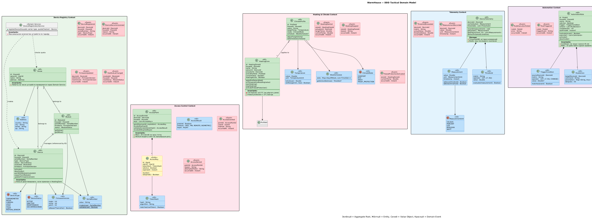

* **Схема потоков доменных событий через Kafka (Kafka Domain Event Flow):** исходный код схемы: [ddd_event_flow.puml](diagrams/ddd_event_flow.puml)
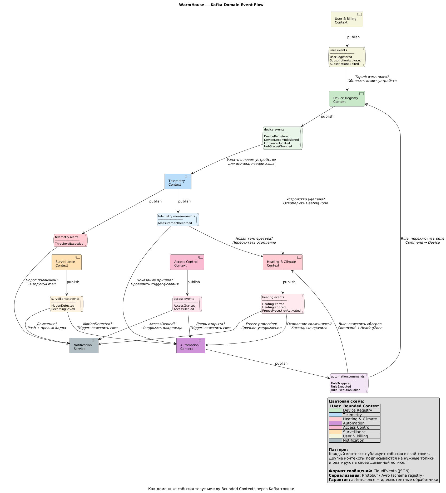

### **4. Проблемы монолитного решения**

- **Блокирующие синхронные запросы (Tight Coupling):** Прямой опрос внешнего Temperature API во время HTTP-запроса пользователя приводит к задержкам. В случае падения внешнего API весь список датчиков возвращает ошибку или зависает.
- **Невозможность масштабирования:** Текущая архитектура рассчитана на 100 клиентов. При переходе к масштабу целых посёлков синхронный опрос тысяч датчиков вызовет отказ системы из-за исчерпания пула потоков/соединений и перегрузки БД.
- **Сложность расширения функционала:** Попытка внедрить управление воротами, светом и камерами в единую кодовую базу монолита силами 5 разработчиков приведет к конфликтам слияния кода, усложнит тестирование и сделает развертывание рискованным (ошибка в модуле ворот может сломать отопление).
- **Отсутствие самообслуживания:** Жёсткая привязка к ручному конфигурированию базы данных специалистом компании. У монолита нет API для самостоятельной регистрации устройств пользователями.

### 5. Визуализация контекста системы — диаграмма С4

Диаграмма контекста As-Is, отражающая взаимодействие монолита «Тёплый дом» с пользователями, инженерами и внешним API датчиков (исходный код схемы: [context.puml](diagrams/context.puml)):

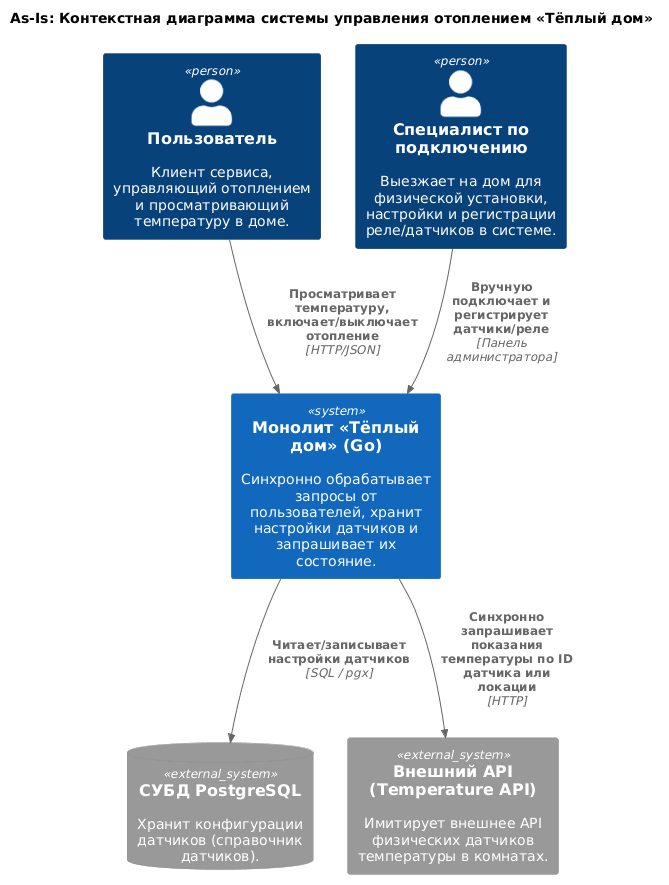

# Задание 2. Проектирование микросервисной архитектуры

В этом задании вам нужно предоставить только диаграммы в модели C4. Мы не просим вас отдельно описывать получившиеся микросервисы и то, как вы определили взаимодействия между компонентами To-Be системы. Если вы правильно подготовите диаграммы C4, они и так это покажут.

**Диаграмма контейнеров (Containers)**

* Исходный код схемы: [container.puml](diagrams/container.puml)

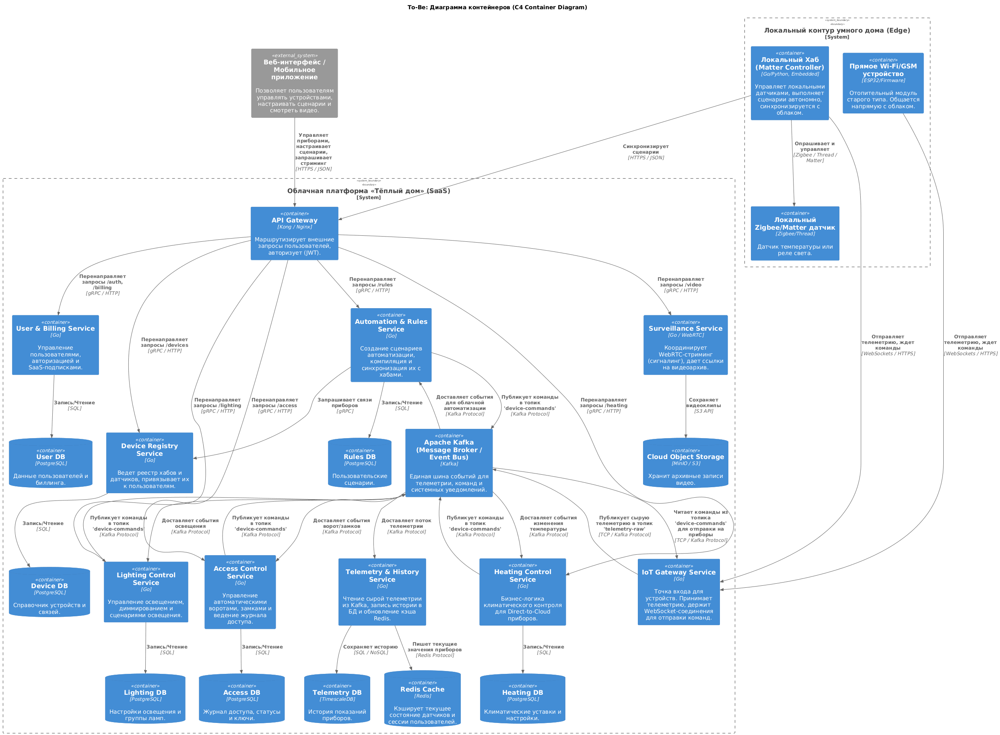

**Диаграмма компонентов (Components)**

Ниже представлены диаграммы компонентов для ключевых микросервисов:

1. **Device Registry Service (Реестр устройств):** (исходный код схемы: [components.puml](diagrams/device_registry/components.puml))
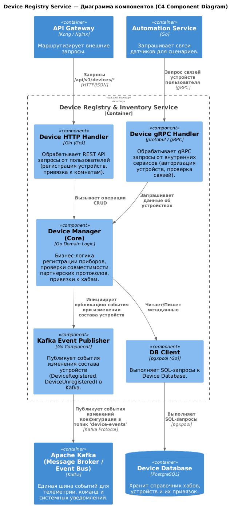

2. **IoT Gateway Service (Шлюз устройств):** (исходный код схемы: [components.puml](diagrams/iot_gateway/components.puml))
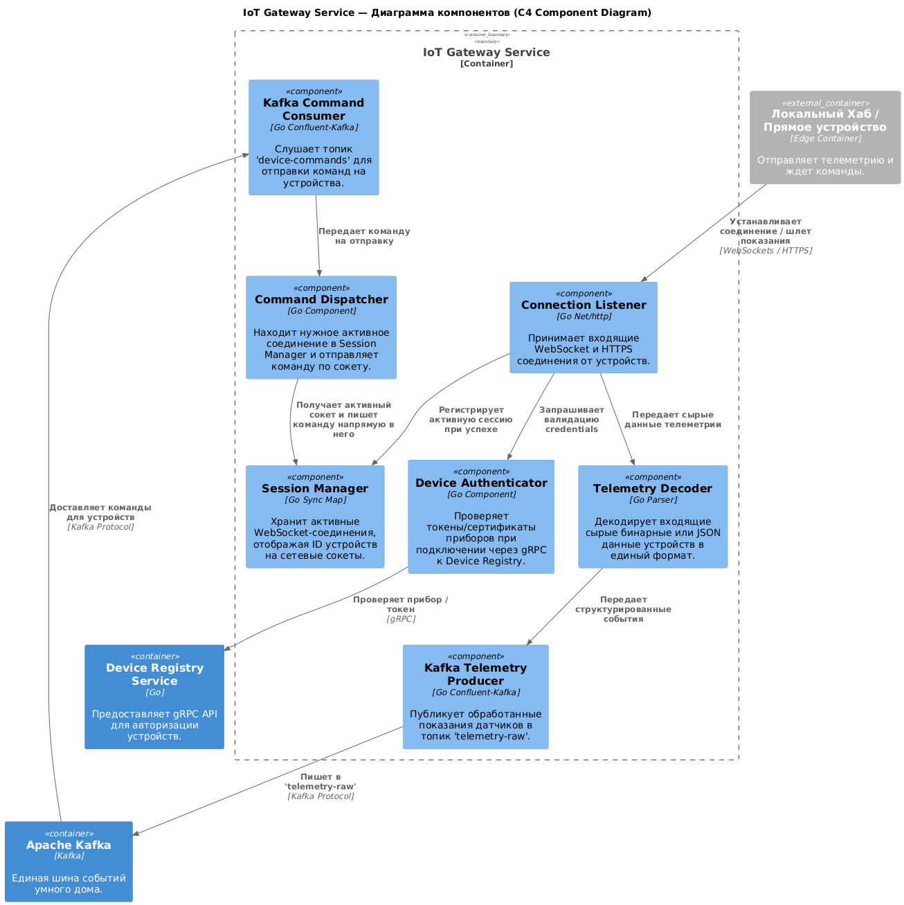

3. **Local Hub (Локальный Хаб):** (исходный код схемы: [components.puml](diagrams/local_hub/components.puml))
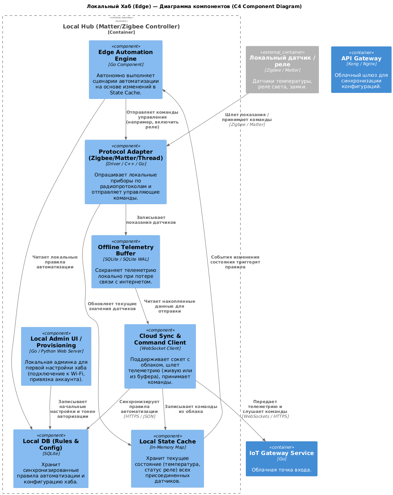

**Диаграмма кода (Code)**

Ниже представлены диаграммы кода (низкоуровневой структуры классов/пакетов) для основных компонентов:

1. **Device Registry Service (Реестр устройств):** (исходный код схемы: [code.puml](diagrams/device_registry/code.puml))
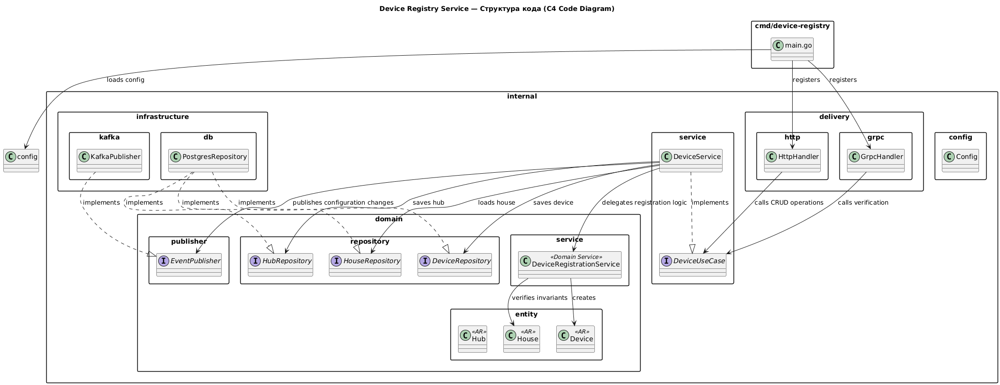

2. **IoT Gateway Service (Шлюз устройств):** (исходный код схемы: [code.puml](diagrams/iot_gateway/code.puml))
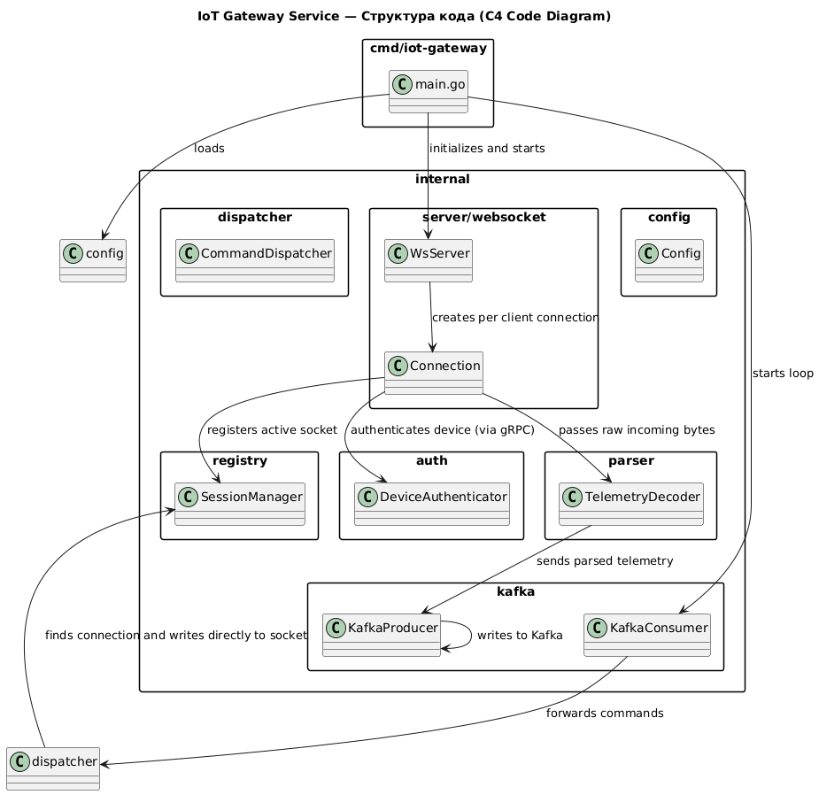

3. **Local Hub (Локальный Хаб):** (исходный код схемы: [code.puml](diagrams/local_hub/code.puml))
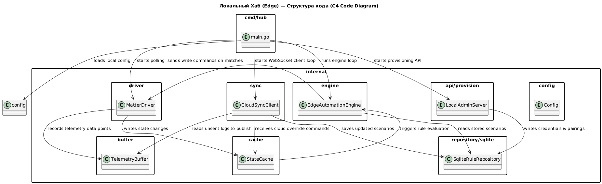

# Задание 3. Разработка ER-диаграммы

Целевая база данных спроектирована с учетом паттерна **Database per Service** (база данных для каждого микросервиса), что гарантирует независимость и слабую связанность сервисов. Ниже представлена логическая модель, объединяющая таблицы всех доменов платформы.

### 1. Визуализация схемы базы данных (ER-диаграмма)

* Исходный код схемы: [er.puml](diagrams/er.puml)

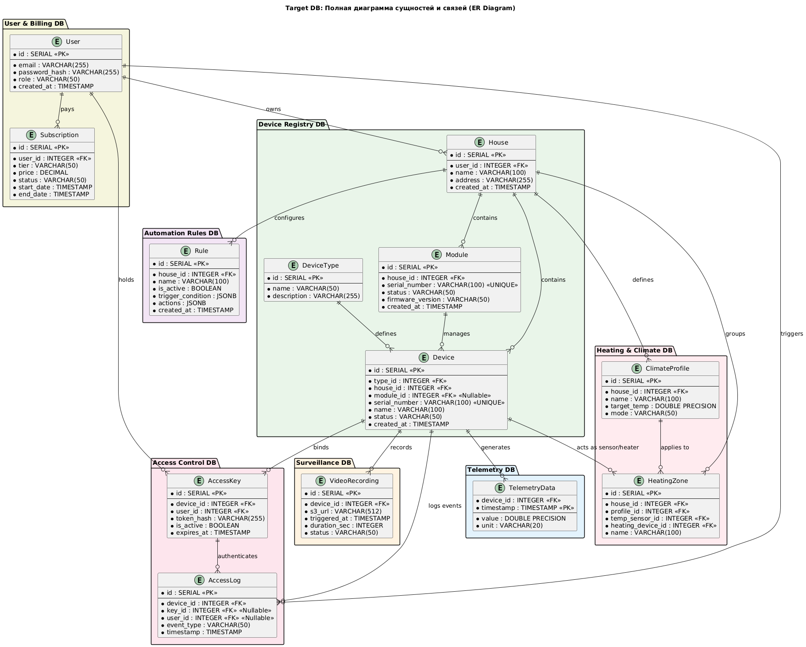

---

### 2. Описание сущностей и атрибутов по доменам

#### A. Домен пользователей и биллинга (User & Billing DB)
* **User (Пользователи):**
  * `id` (SERIAL, PK) — уникальный идентификатор пользователя.
  * `email` (VARCHAR(255)) — электронная почта (логин).
  * `password_hash` (VARCHAR(255)) — хэш пароля.
  * `role` (VARCHAR(50)) — роль (клиент, администратор, выездной специалист).
  * `created_at` (TIMESTAMP) — дата регистрации.
* **Subscription (Подписки SaaS):**
  * `id` (SERIAL, PK) — ID записи подписки.
  * `user_id` (INTEGER, FK) — ссылка на пользователя.
  * `tier` (VARCHAR(50)) — уровень подписки (Free, Basic, Premium).
  * `price` (DECIMAL) — стоимость.
  * `status` (VARCHAR(50)) — статус оплаты/активности.
  * `start_date` / `end_date` (TIMESTAMP) — период действия.

#### B. Домен инвентаря и структуры (Device Registry DB)
* **House (Дома клиентов):**
  * `id` (SERIAL, PK) — уникальный ID дома.
  * `user_id` (INTEGER, FK) — ссылка на владельца.
  * `name` (VARCHAR(100)) — пользовательское имя (например, "Дача").
  * `address` (VARCHAR(255)) — физический адрес.
  * `created_at` (TIMESTAMP) — дата добавления.
* **Module (Модули / Хабы):**
  * Физический локальный контроллер или прямое Wi-Fi устройство.
  * `id` (SERIAL, PK).
  * `house_id` (INTEGER, FK) — к какому дому относится.
  * `serial_number` (VARCHAR(100), UNIQUE) — серийный номер.
  * `status` (VARCHAR(50)) — статус (активен, оффлайн, не настроен).
  * `firmware_version` (VARCHAR(50)) — версия прошивки.
* **DeviceType (Справочник типов приборов):**
  * `id` (SERIAL, PK).
  * `name` (VARCHAR(50)) — имя типа (Термометр, Реле, Замок, Камера).
  * `description` (VARCHAR(255)) — описание.
* **Device (Физические датчики и исполнительные устройства):**
  * `id` (SERIAL, PK).
  * `type_id` (INTEGER, FK) — тип прибора.
  * `house_id` (INTEGER, FK) — к какому дому привязан.
  * `module_id` (INTEGER, FK, Nullable) — через какой хаб работает (NULL для direct-to-cloud).
  * `serial_number` (VARCHAR(100), UNIQUE) — заводской серийный номер.
  * `name` (VARCHAR(100)) — имя прибора ("Датчик в гостиной").
  * `status` (VARCHAR(50)) — текущее состояние (активно/неактивно).

#### C. Домен телеметрии (Telemetry DB - временной ряд)
* **TelemetryData (Показания датчиков):**
  * `device_id` (INTEGER, FK) — ID датчика.
  * `timestamp` (TIMESTAMP, PK) — время замера.
  * `value` (DOUBLE PRECISION) — числовое значение (температура, влажность).
  * `unit` (VARCHAR(20)) — единица измерения (°C, %).

#### D. Домен видеонаблюдения (Surveillance DB)
* **VideoRecording (Архив видеоклипов по событиям):**
  * `id` (SERIAL, PK).
  * `device_id` (INTEGER, FK) — ID камеры.
  * `s3_url` (VARCHAR(512)) — ссылка на файл записи в объектном хранилище.
  * `triggered_at` (TIMESTAMP) — время события движения.
  * `duration_sec` (INTEGER) — длительность в секундах.

#### E. Домен контроля доступа (Access Control DB)
* **AccessKey (Ключи доступа / ПИН-коды):**
  * `id` (SERIAL, PK).
  * `device_id` (INTEGER, FK) — к какому замку/воротам подходит.
  * `user_id` (INTEGER, FK) — кто владелец ключа.
  * `token_hash` (VARCHAR(255)) — хэш карты/пина.
  * `is_active` (BOOLEAN) — активен ли ключ.
  * `expires_at` (TIMESTAMP) — срок действия.
* **AccessLog (Журнал проходов):**
  * `id` (SERIAL, PK).
  * `device_id` (INTEGER, FK) — замок или ворота.
  * `key_id` (INTEGER, FK, Nullable) — какой ключ применен.
  * `user_id` (INTEGER, FK, Nullable) — какой пользователь проходил.
  * `event_type` (VARCHAR(50)) — событие (Open, Closed, Denied).
  * `timestamp` (TIMESTAMP) — время события.

#### F. Домен сценариев (Automation Rules DB)
* **Rule (Правила автоматизации):**
  * `id` (SERIAL, PK).
  * `house_id` (INTEGER, FK) — дом, для которого настроено правило.
  * `name` (VARCHAR(100)) — имя сценария.
  * `is_active` (BOOLEAN) — статус работы.
  * `trigger_condition` (JSONB) — гибкое условие срабатывания в формате JSON.
  * `actions` (JSONB) — последовательность действий при срабатывании.

#### G. Домен отопления и климата (Heating DB)
* **ClimateProfile (Климатические режимы):**
  * `id` (SERIAL, PK).
  * `house_id` (INTEGER, FK) — дом профиля.
  * `name` (VARCHAR(100)) — название ("Комфорт", "Эко").
  * `target_temp` (DOUBLE PRECISION) — целевая температура климата.
* **HeatingZone (Зоны отопления):**
  * Объединяет датчики и обогреватели для терморегуляции.
  * `id` (SERIAL, PK).
  * `house_id` (INTEGER, FK).
  * `profile_id` (INTEGER, FK) — текущий профиль зоны.
  * `temp_sensor_id` (INTEGER, FK) — датчик температуры в зоне.
  * `heating_device_id` (INTEGER, FK) — котел/обогреватель, обогревающий зону.
  * `name` (VARCHAR(100)) — название зоны ("Гостиная").

---

### 3. Описание ключевых связей

1. **User — House (Один-ко-многим):** Один пользователь может зарегистрировать несколько домов (квартира, загородный коттедж), но каждый дом жестко принадлежит одному аккаунту владельца.
2. **House — Module (Один-ко-многим):** В доме может стоять несколько хабов/контроллеров (например, для разных этажей или построек на участке).
3. **House — Device (Один-ко-многим):** Устройства привязаны к конкретному дому, что гарантирует изоляцию данных между клиентами.
4. **Module — Device (Один-ко-многим):** Локальный хаб управляет пулом Zigbee/Matter устройств. Для устройств direct-to-cloud связь `module_id` равна `NULL`.
5. **Device — TelemetryData (Один-ко-многим):** Измерительный прибор отправляет множество последовательных записей телеметрии.
6. **Device — VideoRecording (Один-ко-многим):** Камера записывает множество клипов при сработках.
7. **ClimateProfile — HeatingZone (Один-ко-многим):** Один температурный профиль (например, "Эко") может быть применен одновременно к нескольким зонам отопления.
8. **Device (Sensor/Actuator) — HeatingZone (Многие-к-одному):** В зону отопления назначаются конкретные датчики и реле управления нагревателями.

# Задание 4. Создание и документирование API

### 1. Типы API и обоснование выбора

В платформе «Тёплый дом» используются **три типа API**, каждый из которых оптимален для своего класса взаимодействий:

| Тип API | Стандарт документирования | Назначение | Обоснование |
|---|---|---|---|
| **REST API** | OpenAPI 3.0 (Swagger) | Внешние клиенты (мобильное приложение, веб-дашборд) → API Gateway → микросервисы | Стандарт де-факто для публичных API. Удобен для фронтенд-разработчиков, легко тестируется через Postman/curl, поддерживает кэширование через HTTP-заголовки |
| **gRPC** | Protocol Buffers (.proto) | Синхронные запросы между микросервисами (service-to-service) | Бинарный протокол с минимальными накладными расходами. Строгая типизация через Protobuf. Автогенерация клиентов на Go/Java/Python. Поддержка streaming для больших ответов |
| **Async Events** | AsyncAPI 2.6 | Асинхронное событийное взаимодействие через Apache Kafka | Развязка сервисов: публикатор не знает о подписчиках. Гарантированная доставка (at-least-once). Естественный способ распространения доменных событий (DDD) |

**Почему не только REST?** REST подразумевает синхронный request-response. Но в IoT-системе:
- Телеметрия приходит потоком тысяч сообщений/сек → нужен Kafka.
- Межсервисные запросы (например, «получить информацию об устройстве» из Heating Service) требуют минимальной латентности → gRPC быстрее REST в 2-10x за счёт бинарной сериализации и HTTP/2.
- Доменные события (DeviceRegistered, HeatingStarted) должны доставляться всем заинтересованным сервисам без жёсткой связи → Kafka pub/sub.

---

### 2. Документация API

#### A. REST API — OpenAPI 3.0

📄 **Спецификация:** [api/openapi.yaml](api/openapi.yaml)

Внешний REST API проходит через API Gateway и покрывает 5 ключевых эндпоинтов:

| # | Метод | Эндпоинт | Описание | Сервис |
|---|---|---|---|---|
| 1 | `POST` | `/houses/{houseId}/devices` | Зарегистрировать новое устройство | Device Registry |
| 2 | `GET` | `/devices/{deviceId}` | Получить информацию об устройстве | Device Registry |
| 3 | `GET` | `/devices/{deviceId}/telemetry` | Получить показания датчика | Telemetry |
| 4 | `POST` | `/devices/{deviceId}/commands` | Отправить команду устройству | IoT Gateway |
| 5 | `PUT` | `/heating-zones/{zoneId}/profile` | Установить климатический профиль | Heating |

Для каждого эндпоинта в спецификации описаны:
- Формат запроса (JSON-схема тела)
- Формат ответа (JSON-схема + примеры)
- HTTP-коды: `200`, `201`, `202`, `400`, `404`, `409`, `422`
- Примеры запросов и ответов в блоке `examples`

**Аутентификация:** Bearer JWT-токен.

---

#### B. Async Events API — AsyncAPI 2.6

В соответствии с лучшими практиками микросервисной разработки, спецификация асинхронного взаимодействия разделена на контракты конкретных сервисов (это позволяет избежать дублирования описания топиков для отправителей и получателей):

*   📄 **Реестр устройств (Device Registry):** [api/device-registry-asyncapi.yaml](api/device-registry-asyncapi.yaml) — описывает события, которые сервис публикует в топик `device.events`, и события, которые он слушает из `user.events`.
*   📄 **Телеметрия (Telemetry):** [api/telemetry-asyncapi.yaml](api/telemetry-asyncapi.yaml) — описывает события, которые сервис публикует в `telemetry.measurements` и `telemetry.alerts`, и его подписку на `device.events`.
*   📄 **Климат-контроль (Heating Control):** [api/heating-asyncapi.yaml](api/heating-asyncapi.yaml) — описывает события, публикуемые в `heating.events`, и подписки на `device.events` и `telemetry.measurements`.

Общая схема движения доменных событий в системе представлена на диаграмме в Задании 1: [Kafka Domain Event Flow](diagrams/ddd_event_flow.puml).

Сводная таблица по топикам и событиям:

| # | Топик | События | Публикатор | Потребители |
|---|---|---|---|---|
| 1 | `device.events` | DeviceRegistered, DeviceDecommissioned, FirmwareUpdated, HubStatusChanged | Device Registry | Telemetry, Heating, Automation |
| 2 | `telemetry.measurements` | MeasurementRecorded | Telemetry | Heating, Automation |
| 3 | `telemetry.alerts` | ThresholdExceeded | Telemetry | Notification |
| 4 | `heating.events` | HeatingStarted, HeatingStopped, FreezeProtectionActivated | Heating | Notification, Automation |
| 5 | `access.events` | AccessGranted, AccessDenied | Access Control | Notification, Automation |
| 6 | `user.events` | SubscriptionActivated, SubscriptionExpired | User & Billing | Device Registry |

**Гарантии:** at-least-once + идемпотентные обработчики.
**Формат обёртки:** CloudEvents v1.0.
**Партиционирование:** по **deviceId** / **houseId** / **userId** для сохранения порядка событий.

---

#### C. gRPC API — Protocol Buffers

📄 **Спецификация:** [api/proto/device_registry.proto](api/proto/device_registry.proto)

Синхронный inter-service API для запросов, требующих немедленного ответа:

| # | RPC-метод | Описание | Вызывающие сервисы |
|---|---|---|---|
| 1 | `GetDevice(deviceId)` | Получить информацию об устройстве | Heating, Automation, Telemetry |
| 2 | `ListHouseDevices(houseId)` | Список устройств дома с фильтрацией | Heating (построение списка зон) |
| 3 | `CheckDeviceQuota(userId)` | Проверить лимит устройств по подписке | API Gateway (при регистрации) |

**Протокол:** HTTP/2 + Protobuf (бинарная сериализация).
**Пагинация:** cursor-based (`page_token`).

# Задание 5. Работа с docker и docker-compose

В ходе выполнения задания было разработано решение для интеграционного тестирования монолита `smart_home` с внешней базой данных PostgreSQL и mock-сервисом показаний температуры.

### 1. Архитектура решения и компоненты

*   **`postgres` (База данных):**
    *   Используется официальный образ `postgres:16-alpine`.
    *   При запуске автоматически инициализирует схему данных и первоначальные настройки таблиц с помощью скрипта `./smart_home/init.sql`, примонтированного в директорию `/docker-entrypoint-initdb.d/init.sql`.
    *   Настроен `healthcheck` с использованием утилиты `pg_isready` (проверяется готовность БД `smarthome` и пользователя `postgres`), чтобы зависимые контейнеры запускались только после полной готовности СУБД.
*   **`temperature-api` (Mock-сервис температурных датчиков):**
    *   Реализован на **TypeScript** и фреймворке **NestJS**.
    *   Содержит раздельные методы в `TemperatureService` для обработки логики:
        *   `getTemperatureByLocation(location: string)` — маппирует имя локации в ID датчика (`Living Room` ↔ `1`, `Bedroom` ↔ `2`, `Kitchen` ↔ `3`) и генерирует случайную температуру.
        *   `getTemperatureBySensorId(sensorId: string)` — маппирует ID датчика обратно в локацию и генерирует данные.
        *   Возвращаемые значения температуры лежат в диапазоне от `15.0°C` до `28.0°C` с точностью до 1 знака после запятой.
    *   Поддерживает ручки:
        *   `GET /health` — для проверки работоспособности сервиса.
        *   `GET /temperature` — принимает query-параметры `location`, `sensor_id` или `sensorId`.
        *   `GET /temperature/:sensorID` — принимает идентификатор в пути.
    *   Упакован в оптимизированный многоэтапный **Dockerfile** (Multi-stage build) на базе `node:20-alpine`, что позволило скомпилировать TypeScript код на этапе сборки и исключить лишние `devDependencies` в итоговом образе для минимизации его размера.
*   **`app` (Монолитное Go-приложение):**
    *   Контейнеризован с помощью предоставленного Dockerfile.
    *   Связан переменными окружения с СУБД (`DATABASE_URL`) и mock-сервисом (`TEMPERATURE_API_URL`).
    *   Запускается только после готовности СУБД (настроен `depends_on` с условием `service_healthy`).

Все три контейнера объединены в общую изолированную сеть `smarthome-network` типа `bridge`.
